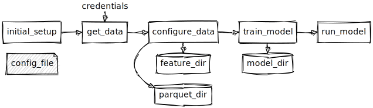

notes
-----

steps in the process

# Jupyter Notebooks
initial experiments using jupyter notebooks.
[sample](../notebooks/)

once code is mostly correct, proceed to write in pure python
resulting in

# Cleaned Python

- credentials
    - credential handling depends on environment.  For this example need the kaggle.json file with username and key. (don't want to put those into a public repository)

- config file
    - contains local paths
    - logging config
    - data source location

- initial setup
    - check and create required directories if needed

- get data
    - download data and store locally

- configure data
    - etl step, convert the csv to parquet, and create feature data

- train model
    - train model on given data
    - persist model to local drive
    - run tests

- run model
    - load persisted model
    - run tests

- api server
    - load persisted model
    - serve requests to model

to ensure stable builds, using poetry to control all libraries.

# Containers

Packaged python using [poetry](https://python-poetry.org/) to ensure all dependencies stay constant.

can run container with syntax `docker run --env-file ./kaggle.env -it -p 5000:5000 -v /localdata:/twdata $CONTAINER_ID /bin/bash`
where `kaggle.env` contains the kaggle credentials.  (only needed for the load data step).

the -v flag is required to persist the data.

todo: add step to persist outside container to external source.  Could be S3 or some other data store -> requires credentials/permissions/access

four main, different uses:

1. load data
    - mostly I/O, may be external internet not much memory or cpu
    - external internet/ credentials
        - higher security
2. configure data
    - local I/O, may be high cpu (depending on changes/features)
3. train model
    - heavy compute, may be heavy memory, also I/O
4. model api server
    - depending on use case;  medium compute/memory, may be high I/O ?
    - may be external facing
        - higher security

## Notes:
found with default code given, required ~ 170 Gig memory/disk for the model.  So (3) and (4) require larger memory (or swap) to complete, if model is run on single instance.

todo: determine if model can be split into smaller bits, and run on distinct (smaller) instances in parallel.  Review complexity+maintenance cost/runtime cost relationship.

# Deploy

most familiar with AWS to deploy. 

using graphviz .dot format for diagrams, and a cli version of sketchviz
